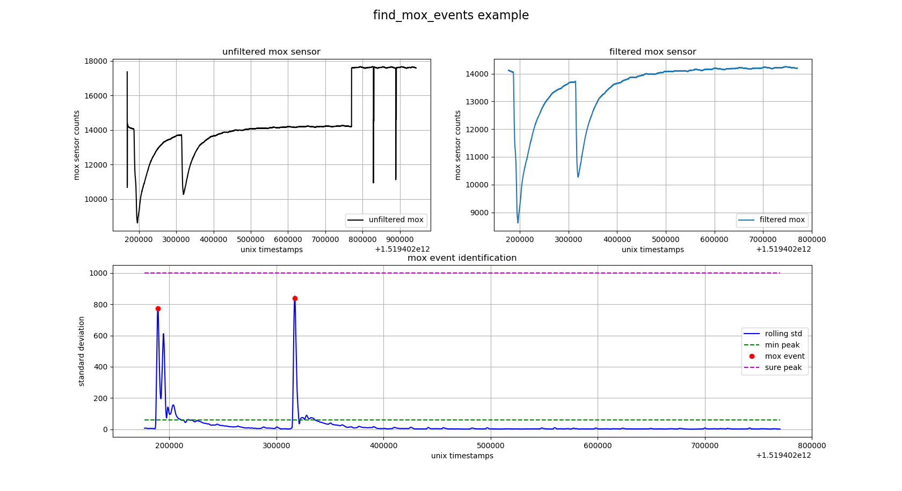

find\_mox\_events package
=========================

Submodules
----------

find\_mox\_events.find\_mox\_events module
------------------------------------------

.. automodule:: find_mox_events.find_mox_events
    :members:
    :undoc-members:
    :show-inheritance:

find\_mox\_events uses `scipy.signal.find\_peaks\_cwt`_.	
	

.. _scipy.signal.find\_peaks\_cwt: https://docs.scipy.org/doc/scipy/reference/generated/scipy.signal.find_peaks_cwt.html

Module contents
---------------

.. automodule:: find_mox_events
    :members:
    :undoc-members:
    :show-inheritance:
